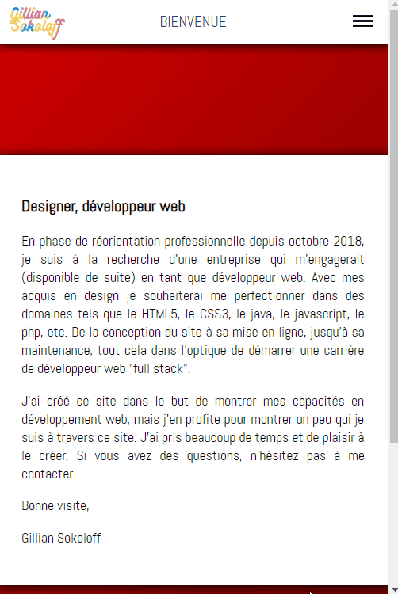

# First Website
My first attempt to create from scratch a HTML & CSS website (responsive)
I made it to create something by myself. 
I used HTML & CSS, with a tiny bit of JavaScript and SublimeText 3 for IDE.

[Git page](https://socalloff.github.io/first-ever-website-2018/index.html)

